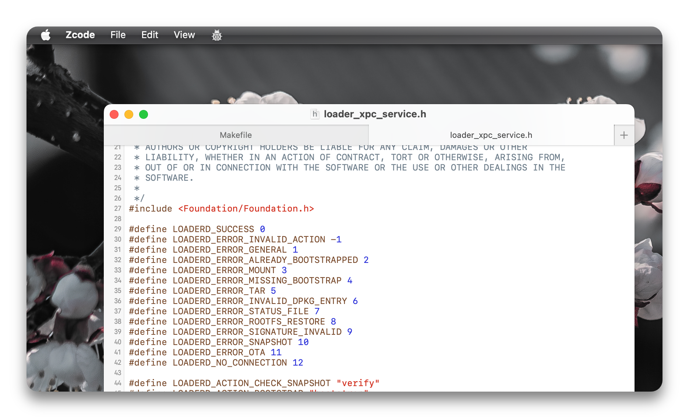

# Zcode

A texteditor using Xcode's private DVT frameworks.

## Preview

    <picture>
        <source media="(prefers-color-scheme: dark)" srcset="Images/dark.png">
        <source media="(prefers-color-scheme: light)" srcset="Images/light.png">
        
    </picture>

## Why make Zcode?

I wanted to write [Ycode](https://github.com/asentientbot/ycode) in swift rather than have it in Objective-C, so I went ahead and did that for learning purposes.

## Build

- Run `make package`
- This will output to `packages`, drag it into `/Applications`
